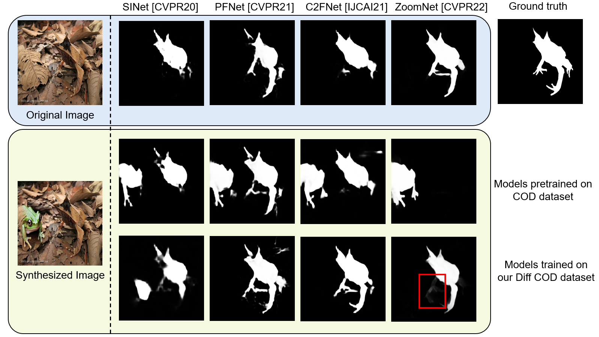

# CamDiff (CAAI AIR 2023)
Official implementation of [CamDiff: Camouflage Image Augmentation via Diffusion](https://www.sciopen.com/article/pdf/10.26599/AIR.2023.9150021.pdf?ifPreview=0)

**CamDiff** is an approach inspired by AI-Generated Content (AIGC) that overcomes the scarcity of multi-pattern training images. Specifically, CamDiff leverages the [latent diffusion model](https://huggingface.co/runwayml/stable-diffusion-inpainting) to synthesize salient objects in camouflaged scenes, and use the zero-shot image classification ability of the [CLIP model](https://openai.com/research/clip) to prevent synthesis failures and ensure the synthesized object aligns with the input prompt. 

Consequently, the synthesized image retains its original camouflage label while incorporating salient objects, yielding camouflage samples with richer characteristics. The results of user studies show that the salient objects in the scenes synthesized by our framework attract the user's attention more; thus, such samples pose a greater challenge to existing COD models.


The synthesized object is within a green box, while the original object within the image was enclosed in a red box. 

## Requirement
A suitable [conda](https://conda.io/) environment named `camdiff` can be created and activated with:
```` bash
# Create env
conda create -n camdiff python=3.10
conda activate camdiff

# Cuda 11.7
conda install pytorch==1.13.0 torchvision==0.14.0 torchaudio==0.13.0 pytorch-cuda=11.7 -c pytorch -c nvidia

!pip install -qq -U diffusers==0.11.1 transformers ftfy gradio accelerate
pip install git+https://github.com/openai/CLIP.git
````

## Usage
### Generation
Download the COD datasets in the `Dataset` folder. The dataset needs to include 'Imgs' and 'GT' folder.
```` bash
python inpainting_diff.py --indir ./Dataset --outdir ./result
```` 
### Dataset

Here is the overview of the dataset:

`Imgs` folders include the original images in COD datasets.

`GT` folders include the original masks in COD dataset.

The `new` folders in the testing set include the synthesized images. In the training set, the `new1+1` folder replaces 3717 images in Imgs with the synthesized images. The `new3` folder extends each image to generate three additional images of the same class using CamDiff.

The dataset can be downloaded [here](https://drive.google.com/file/d/1g6_8TX4FNxy6lLE9piCQMe0nmr8693dZ/view?usp=share_link). (Dataset size: ~5GB)

```shell
COD-RGBD
  COD-TestDataset
    CAMO
      Imgs
        XXXXXX.jpg
      GT
        XXXXXX.png
      new
        XXXXXX.jpg
    CHAMELEON
      Imgs
      GT
      new
    COD10K
      Imgs
      GT
      new
    NC4K
      Imgs
      GT
      new
  COD-TrainDataset
    Imgs
    GT
    new1+1
    new3
```


## Paper Details
### Generation Results 
Examples of the synthesized images from CamDiff from various classes. Each image is extended to generate three additional images of the same class, featuring objects with varying appearances. 


### Evaluation on the robustness to saliency of COD models
The first row: the results of the models that were pretrained on COD datasets, and then tested on the original images. They show a good performance of detecting the camouflaged objects.

The second row: the results of the models that use the same checkpoints as the first row, and then tested on the synthesized images. Most of them detect the salient objects, which is undesired. Meanwhile, the accuracy of detecting camouflaged objects decrease. For example, SINet lose some parts compared with the mask in the first row. ZoomNet even ignores the camouflaged objects. The results demonstrate the COD methods lack robustness to saliency.

The third row: the results of the models that use the checkpoints trained on our Diff-COD dataset, and then tested on the synthesized images. Compared with the second row, the robustness to saliency improves significantly.



## Citation
If you find this repo useful, please consider citing:

```
@article{luo2023camdiff, 
author = {Luo, Xue-Jing and Wang, Shuo and Wu, Zongwei and Sakaridis, Christos and Cheng, Yun and Fan, Deng-Ping and Van Gool, Luc},
title = {CamDiff: Camouflage Image Augmentation via Diffusion Model},
year = {2023},
journal = {CAAI Artificial Intelligence Research},
}
  
```


