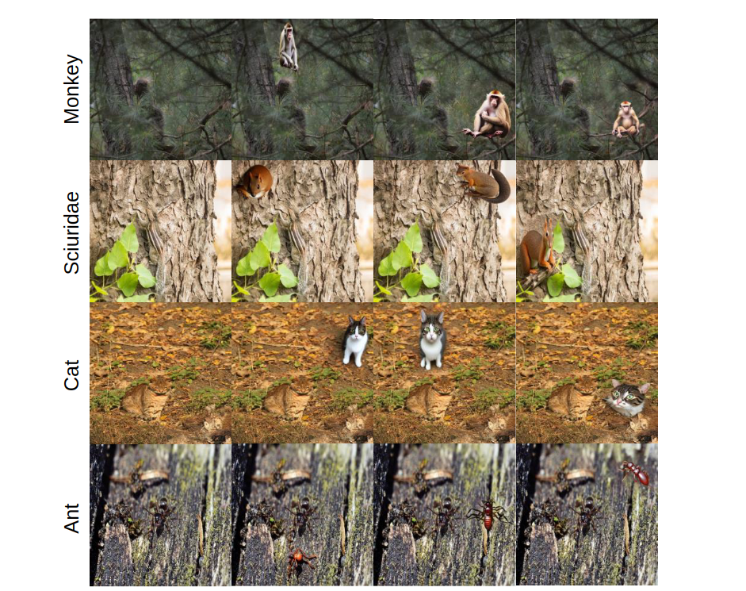

# CamDiff

## Create environment
```` bash
# Create env
conda create -n camdiff python=3.10
conda activate camdiff

# Cuda 11.7
conda install pytorch==1.13.0 torchvision==0.14.0 torchaudio==0.13.0 pytorch-cuda=11.7 -c pytorch -c nvidia

!pip install -qq -U diffusers==0.11.1 transformers ftfy gradio accelerate
pip install git+https://github.com/openai/CLIP.git
````

## Image Generation
Download COD datasets in the Dataset folder. The dataset needs to include 'Imgs' and 'GT' folder.
```` bash
python inpainting_diff.py --indir ./Dataset --outdir ./result
```` 
The generated dataset can be downloaded: 

## Paper Details
### Generation Results 
The figure shows the synthesized images from our framework from various classes. On the left side, the text is the input prompt, and each image is extended to generate three additional images of the same class, featuring objects with varying appearances. 


### Evaluation on the robustness to saliency of COD models
The first row: the results of the models that were pretrained on COD datasets, and then tested on the original images. They show a good performance of detecting the camouflaged objects.

The second row: the results of the models that use the same checkpoints as the first row, and then tested on the synthesized images. Most of them detect the salient objects, which is undesired. Meanwhile, the accuracy of detecting camouflaged objects decrease. For example, SINet lose some parts compared with the mask in the first row. ZoomNet even ignores the camouflaged objects. The results demonstrate the COD methods lack robustness to saliency.

The third row: the results of the models that use the checkpoints trained on our Diff-COD dataset, and then tested on the synthesized images. Compared with the second row, the robustness to saliency improves significantly.


